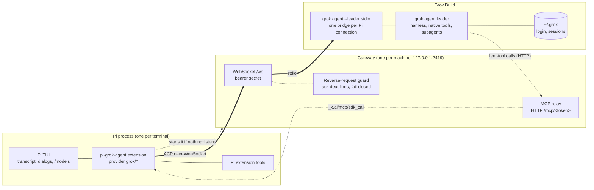
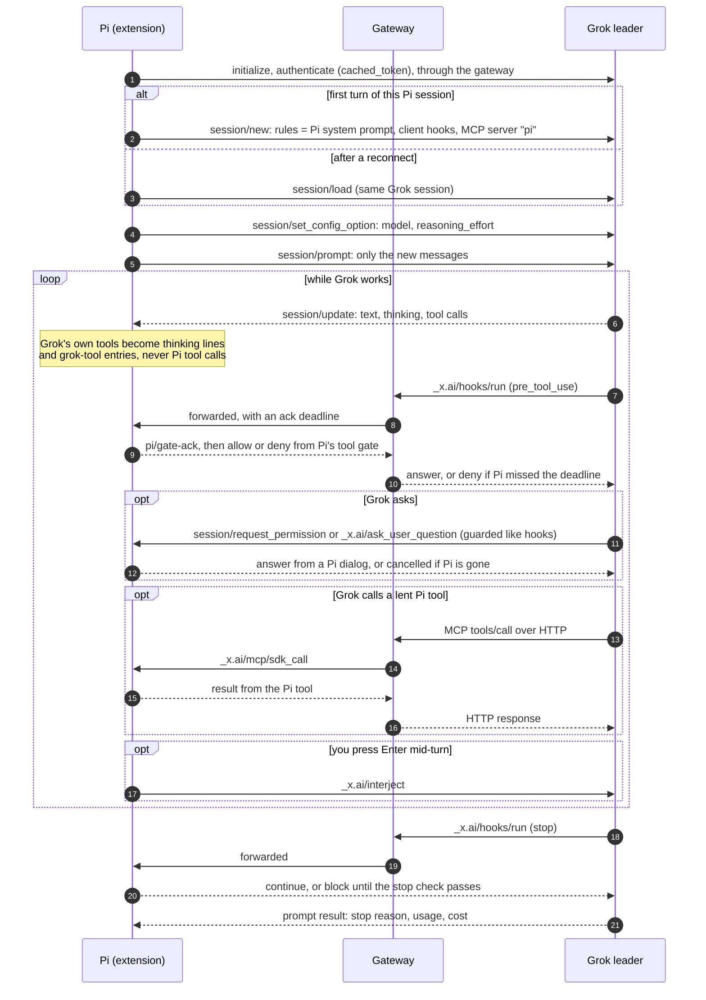

# pi-grok-agent

Grok's agent. Pi's workflow.

```sh
pi install npm:pi-grok-agent
```

That is the whole installation. Then pick a Grok model in Pi's `/models` and send a message. See the [quick start](#quick-start).

This package runs [Grok Build](https://docs.x.ai/build/overview) as a model in the [Pi coding agent](https://github.com/earendil-works/pi). Grok keeps its own harness, its native tools, and its session history. Pi drives the turns and adds what it gives every model: the transcript, permission dialogs, tool gates, and extension tools.

Two things this package is not:

- It connects the Grok Build agent over ACP, not the xAI chat-completions API. You need the Grok Build CLI and its own login.
- Its tool gates are not an operating-system sandbox. Grok runs with your user's permissions.

Version 0.1.1 on [npm](https://www.npmjs.com/package/pi-grok-agent) and as a [GitHub release](https://github.com/JangMan-J/pi-grok-agent/releases/tag/v0.1.1). Developed and tested on Linux with Node.js 26.10.0, Pi 0.87.1, and Grok Build 1.0.41. Other versions and platforms are untested. The recorded runs are in [docs/launch-verification.md](docs/launch-verification.md).

[Requirements](#requirements) · [Quick start](#quick-start) · [First result](#first-result) · [What Pi adds](#what-pi-adds) · [Models](#models) · [Limitations](#limitations) · [Safety](#safety) · [Reference](docs/usage.md)

## Requirements

| Item | Requirement |
| --- | --- |
| Grok account | A [grok.com](https://grok.com) account, any membership tier. A free account works: verified live on 2026-09-28 with Grok Build 1.0.41, where headless turns returned `PONG` and a read-only tool turn answered correctly ([docs/launch-verification.md](docs/launch-verification.md)). Grok usage counts against that account. |
| Grok Build CLI | `grok` on `PATH`, or its path in `PI_GROK_BINARY`. |
| Grok login | Only if Grok Build is not signed in yet. Run `/grok login` in Pi, or `grok login` in a terminal. Both use Grok's own device-code sign-in, and Grok keeps the credential in `~/.grok/auth.json`; Pi stores nothing (`src/login.ts`). Pi's `/login` xAI entry is a separate login and does not sign in Grok Build, and `XAI_API_KEY` does not replace it. |
| Pi | Tested with 0.87.1. Other versions are untested. [Install Pi first](https://github.com/earendil-works/pi#quick-start). |
| Node.js | 22.19 or later, Pi's minimum (`engines` in `package.json`). Only 26.10.0 is tested here. |
| Optional | A terminal with inline image support. ImageMagick 7 (`magick`) shows JPEG, WebP, and GIF inline; PNG needs no converter. |

Pi shows the cost Grok reports for each turn. Which models your account may use is Grok's decision, not this package's — see [Models](#models).

## Quick start

1. Install the package:

   ```sh
   pi install npm:pi-grok-agent
   ```

2. Start Pi in your project and pick a Grok model in `/models`: Grok 4.7, Grok 4.7 Build Fast, Grok 4.6, or Grok 4.5.
3. If Grok Build is not signed in, run `/grok login` and approve the code in your browser. Grok runs its own device-code sign-in and stores the credential in `~/.grok/auth.json`; Pi stores nothing (`src/login.ts`).
4. Send a message and watch the `grok-tool` lines appear. See [First result](#first-result) for what a healthy first turn looks like.

The first Grok turn starts the local gateway that ships with the package and waits for it, about 5 seconds. The gateway listens on loopback at `127.0.0.1:2419`; `GROK_ACP_URL` picks another loopback port.


<details>
<summary>Diagram source (mermaid)</summary>



</details>

Pi drives the turn and Grok drives the callbacks, both over the Agent Client Protocol. [How it works →](docs/usage.md#components) · [Gateway guard →](docs/usage.md#gateway-guard) · [Design notes →](docs/first-class-model.md)

There is no global install and no gateway to start by hand: the recorded install runs used only `pi install npm:pi-grok-agent`, with nothing listening on that port and no `pi-grok-gateway` on `PATH` ([docs/launch-verification.md](docs/launch-verification.md), rows `G2, npm, one command` and `G2, public npm`).

The gateway keeps running after Pi exits, and every Pi process on the machine shares it. Its first start creates the shared secret `~/.pi/agent/grok-ws.secret` with mode 0600 and logs to `~/.pi/agent/grok-ws.log` (`src/launch.ts`, `src/config.ts`). To stop it, disable auto-start, or run it yourself under a service manager, see [gateway auto-start](docs/usage.md#gateway-auto-start).

Pi loads the extension at every start, for every model. To remove it, run `pi remove npm:pi-grok-agent`.

## First result

Start Pi in any project directory that has a `package.json`, and send this prompt:

```text
Read package.json and tell me the package name and the npm scripts. Do not change files.
```

Expected result:

- One line for each Grok tool call, for example `✓ grok read_file …` or `✓ grok hashline_read …`, with its duration. Grok chooses the tool, so do not require a particular tool name.
- Thinking text that contains `[grok <tool>]` lines.
- An answer that names the package and its scripts, with no edits.
- A footer cost that comes from Grok's usage report.

This is a check for your installation, not a saved transcript. These display paths have source support in `src/model.ts` and `src/model/session.ts` and unit tests in `test/model.test.ts`.

Then run `/grok debug`. It shows the gateway connection, the Grok session ID, the permission modes, token usage, and the lent Pi tools.

If the result is different, see [Troubleshooting](docs/usage.md#troubleshooting). If the model is missing from `/models`, inspect Pi's extension load error. If sign-in fails, use `/grok login`, not Pi's xAI login. Please report what you saw, as described in [Feedback](#feedback).

## What Pi adds

Grok Build already runs an agent with tools, and it can serve ACP to any client. What this package adds is the rest of Pi around that agent:

| You want to… | What happens | Basis |
| --- | --- | --- |
| Keep Grok's native tools | Grok executes the tools its own harness offers — file, shell, search, web, subagent, media. Pi records each call in the transcript and executes none of them. | `test/model.test.ts` |
| See Grok's work as you go | Each native call becomes thinking text plus a `grok-tool` entry, with its status and duration. | `src/model/session.ts` |
| Control edits from Pi | Pi gates Grok's tools before they run through a `pre_tool_use` hook. A read-only Pi session denies Grok's edits and shell; `/grok perms ask` confirms each call. | `src/model/hooks.ts`, `test/hooks.test.ts` |
| Decide inside Pi | Grok's permission prompts become Pi dialogs, and Grok's `ask_user_question` becomes one Pi dialog per question. | `src/model/permissions.ts`, `src/model/questions.ts`, `test/questions.test.ts` |
| Reuse Pi extension tools | Pi lends extension tools to Grok over MCP. Grok calls them as `pi__<name>`, Pi executes the call, and the result continues the same Grok turn. | `src/model/session.ts`, `evidence/model-probe.json` |
| Feed checks back to Grok | After a Grok edit, a syntax check runs on the file and a failure goes back to Grok in the same turn. A configured `stopCheck` can hold the end of a turn. | `src/model/hooks.ts`, `evidence/hooks-live.json` |

### One turn


<details>
<summary>Diagram source (mermaid)</summary>



</details>

### Gates, checks, and lent tools

- Grok keeps the full tool results in its own context. Pi shows a shortened copy: 400 characters in the thinking stream, up to 8000 in the stored `grok-tool` entry, and up to 600 in the expanded entry (`src/model/session.ts`, `src/model.ts`). Lent Pi tool results go back to Grok complete.
- Gate precedence is fixed: a `denyGrokTools` entry always wins, an explicit `allowGrokTools` entry then allows — including past the read-only mirror — and only then does the capability mirror apply. By default, a Pi session without `edit` or `write` denies Grok's edit tools, and a session without `bash` denies Grok's shell (`capabilityGate` in `src/model/hooks.ts`).
- `/grok perms read-only`, `ask`, `auto`, and `yolo` change Pi's gate. Grok's own permission prompts are a separate layer ([details](docs/usage.md#grok-permission-prompts)).
- The default lent-tool policy is `extensions`, which excludes Pi's core tools — `read`, `bash`, `edit`, `write`, `grep`, `find`, `ls` (`PI_CORE_TOOLS` in `src/config.ts`).
- The built-in post-edit syntax check covers TypeScript, JavaScript, Python, JSON, and Rust, chosen by file extension; anything else needs a configured `postEditCheck` (`BUILTIN_CHECKS` in `src/model/hooks.ts`).

### Turn controls

- Pi's thinking level sets Grok's reasoning effort. Escape cancels the Grok turn (`src/model/provider.ts`, `src/model/session.ts`).
- Mid-turn Enter sends the text to Grok's `_x.ai/interject` method. Unit-tested against a mocked Grok (`test/steer.test.ts`); its effect on a live running turn is not yet verified, and a `grok-steer` entry proves dispatch, not that Grok acted on it. Alt+Enter queues a follow-up turn, as usual in Pi.
- Grok plan mode, `/goal`, and `/compact` are available through `/grok plan`, `/grok goal`, and `/grok compact`. Send a normal prompt first so a Grok session exists ([commands](docs/usage.md#slash-command-grok)).
- After a switch from `grok/*` to another model in the same Pi session, mid-turn Enter goes to that model. The stored Grok session is used again when you switch back (`test/extension.test.ts`).

## Models

| Model ID | Name in `/models` | Reasoning efforts | Context window |
| --- | --- | --- | --- |
| `grok/grok-4.7` | Grok 4.7 | low, medium, high, xhigh | 500,000 tokens |
| `grok/grok-4.7-build-fast` | Grok 4.7 Build Fast | low, medium, high, xhigh | 500,000 tokens |
| `grok/grok-4.6` | Grok 4.6 | low, medium, high, xhigh | 500,000 tokens |
| `grok/grok-4.5` | Grok 4.5 | low, medium, high | 500,000 tokens |

These are the IDs the extension registers (`MODEL_IDS` in `src/model.ts`), not a claim that your account may use all of them. Which models an account has is Grok's decision: `grok models` lists them, and the free account tested here lists only `grok-4.7`. The saved probes used `grok/grok-4.7`.

In 0.1.0 the model picked in Pi was never sent to Grok, so every `grok/*` choice ran Grok's default. Fixed in 0.1.1: Pi sets Grok's `model` config option, and a model the account lacks fails the turn with the list of available models instead of quietly running another one.

Pi's metadata also sets a 32,000-token output limit and a per-token cost of zero, because Grok's rates are not published to Pi; the per-turn cost comes from Grok's own usage report. Other extensions and settings can select these models by ID. The full control mapping is in [docs/usage.md](docs/usage.md#models-and-pi-controls).

## Generated images and video

When a Grok tool result has the type `ImageGen`, `ImageEdit`, `ImageToVideo`, `ReferenceToVideo`, or `VideoGen`, Pi copies the file to `.pi/grok-images/` in the Pi working directory. That directory gets a `.gitignore` that ignores everything in it. If the copy fails or copying is off, the entry keeps Grok's original path (`copyMedia` in `src/model/session.ts`).

After the turn, Pi shows a `grok-media` message with the file path. PNG, JPEG, WebP, and GIF images also show inline when the terminal supports images: PNG shows directly, and Pi converts JPEG, WebP, and GIF to PNG with `magick` first. Without `magick`, you see only the path for those formats. Video files show as a path only; Pi does not play video.

Live probes cover `image_gen` only ([evidence/image-probe.json](evidence/image-probe.json)). The image-edit and video result types are recognized in code but not yet probed with a live Grok run. The media message is for display only: the provider removes it from the prompt, so Grok does not receive its own image back.

Images that you attach in Pi go to Grok as a temporary file under `pi-grok-images` in the system temp directory, written with mode 0600 (`src/model/provider.ts`). Grok reads the file with its own tools. The path route is the one that works: the probe also sent an ACP image block directly, and Grok did not see it.

## Limitations

- The auto-started gateway runs until you stop it or log out. With auto-start off, the gateway must run before the first Grok turn; until it has created its secret file, Grok turns fail with a message that names the file and the command.
- Run one gateway for each port and leader socket. A second default launch exits with `EADDRINUSE` and leaves the running gateway and its leader alone. [Run a separate gateway](docs/usage.md#run-a-second-isolated-gateway) for a demo or a test.
- Grok's native tool calls are not Pi tool calls. Pi records them as thinking text and `grok-tool` entries, and no model receives those entries.
- Pi compaction and Grok compaction are separate. Pi sends only the new messages of each turn, and only a new Grok session also receives the earlier Pi transcript as text, cut to the last 60,000 characters. Pi's `/compact` does not compact Grok's history; use `/grok compact`.
- Grok reads the lent Pi tool list once for each Grok session. A changed tool set needs a new Pi session.
- A gateway restart loses the turn in progress. The next turn reconnects and loads the same Grok session. No saved probe covers that restart, so live recovery is unverified ([docs/launch-verification.md](docs/launch-verification.md) lists reconnect as not run).
- Hashline edits (`hashline_read`, `hashline_edit`, `hashline_grep`) occur only when `~/.grok/config.toml` sets `[toolset] file_toolset = "hashline"`. Otherwise Grok uses tools such as `read_file` and `search_replace`. That switch is Grok's own configuration; this repository does not test it, though `evidence/hooks-probe.json` does show hashline calls.
- The provider does not call Pi's `onPayload` and `onResponse` stream hooks.
- Cost per token is zero in the model metadata. The per-turn cost comes from Grok's report, converted at 1e9 ticks per US dollar. That ratio is inferred by cross-check against SuperGrok rates and is not documented by Grok (`src/model/session.ts`). Without a usage report, usage and cost read as zero — that is not evidence of free usage.

## Safety

- Grok runs with the permissions of your operating-system user. The Grok session directory is not a sandbox, and Pi packages run code with your permissions. Read the source before you install it.
- The gateway listens on loopback only and requires the bearer secret for the WebSocket. It never starts Grok with `--always-approve`. Grok sessions use Grok's `default` permission mode unless you set `grokMode` (`scripts/server.ts`, `src/model/connection.ts`).
- `/grok perms yolo`, `grokMode: "yolo"` or `"auto"`, and `headlessPermissions: "allow"` each remove a different check. Use them only in a workspace you can lose. [usage.md](docs/usage.md#grok-permission-prompts) explains how they differ.
- Headless use does not imply approval. By default, headless Pi cancels Grok's permission prompts and returns a cancelled answer to questions (`src/model/permissions.ts`, `src/model/questions.ts`).
- Hook-handler errors fail open: a throwing handler continues the turn (`src/model/session.ts`). On timeout the gateway guard is stricter and differs by tier — it denies an unanswered pre-tool gate and rejects an unanswered permission prompt, but continues post-tool and stop hooks past their deadlines (`scripts/server.ts`). These are not equivalent guarantees.
- Pi sends its system prompt to Grok as session rules, plus user messages and, for a new Grok session, the earlier Pi transcript.
- `postEditCheck` and `stopCheck` run as shell commands (`bash -lc`) in the working directory. Treat those settings as executable code.

Files and network endpoints are listed in [docs/usage.md](docs/usage.md#files-and-network).

## What the saved probes establish

These are recorded results from one environment, not a guarantee for other versions or platforms. The 2026-09-28 run used Linux, Node.js 26.10.0, Pi 0.87.1, Grok Build 1.0.41, and `grok/grok-4.7`. Eight probes ran in sequence and every one exited 0. They ran against an isolated gateway on port 2429, with the production gateway on 2419 running and untouched throughout — so the saved results did not exercise the default endpoint. Full record: [docs/launch-verification.md](docs/launch-verification.md).

| Area | Saved result | Evidence |
| --- | --- | --- |
| Native execution | Grok read a token and wrote a file. Pi executed zero tools. This run used `headlessPermissions: "allow"`. | [model-live-gateway-extensions.json](evidence/model-live-gateway-extensions.json) |
| Pi controls | Read-only denial, post-edit repair, and a stop check passed. | [hooks-live.json](evidence/hooks-live.json) |
| Lent tools | Grok called a Pi-only tool and answered with the token it returned. | [model-probe.json](evidence/model-probe.json) |
| Gateway guard | No acknowledgment denied a write. Disconnect prevented a write. An acknowledged dialog accepted a later answer. | [gateway-guard-probe.json](evidence/gateway-guard-probe.json) |
| MCP gate | A tool marked read-only reached its server. An unmarked tool was denied. | [mcp-gate-probe.json](evidence/mcp-gate-probe.json) |
| Questions | The answer from a Pi dialog reached Grok. | [question-probe.json](evidence/question-probe.json) |
| Images | `image_gen` produced a JPEG. An attached image worked by file path, and did not work as an ACP image block. | [image-probe.json](evidence/image-probe.json) |

One caveat worth stating plainly: [hooks-probe.json](evidence/hooks-probe.json) records injected `additionalContext` and reports that it was not reflected in the answer. Context delivery alone does not prove that Grok follows it.

Live steering, restart recovery, image editing, and video generation remain unverified here. The saved results do not establish those capabilities.

## Documentation

- [docs/usage.md](docs/usage.md) — settings, lent tools, permissions, the gateway guard, hooks, `/grok` commands, the isolated gateway, checks, and troubleshooting. Ships in the npm package.
- [docs/first-class-model.md](docs/first-class-model.md) — design, turn mapping, and the development record. Ships in the npm package.
- [docs/demo.md](docs/demo.md) — a reproducible storyboard for a 30 to 60 second demo. It is a recording plan, not an existing capture.
- [docs/launch-verification.md](docs/launch-verification.md) — the recorded live runs and install-path checks, with versions, behind the verified claims in this README.
- [AGENTS.md](AGENTS.md) — the source map, invariants, test commands, and the documentation-claim rule for changes to this repository.

On npmjs.com, relative links like these are rewritten to the matching file on GitHub, so they resolve on both pages. In an installed `node_modules` copy only `README.md`, `LICENSE`, `docs/usage.md`, and `docs/first-class-model.md` are present.

## Checks

These commands run from a clone of the repository, not from the installed package:

```sh
npm install          # development dependencies, including TypeScript
npm run check        # tsc --noEmit
npm test             # unit tests plus gateway tests against a fake grok binary, no Grok calls
```

`test/gateway.test.ts` starts the real gateway with `test/fixtures/fake-grok.ts` as the Grok binary, in a scratch `HOME`. It checks leader ownership at startup and shutdown, and the guard's answers on Pi's wire: one answer per request, the deadline for each tier, and fail-closed on disconnect. Nothing in `npm test` contacts Grok.

The rest of the unit tests cover the turn split around a lent tool call, abort and resend, prompt tail selection, display-only messages, usage mapping, tool classification and gates, `/grok perms` modes, guard tier validation, question dialogs, `/grok login` output parsing, steering against a mocked Grok, the steer handler across a model switch, `/grok` command timeout, and media copies.

Before packaging, run `npm pack --dry-run`: the `files` list in `package.json` decides the tarball. The live probes in `scripts/` use your Grok login, spend Grok usage, and write to `evidence/`, which you must create first. Run them only intentionally — see [live probes](docs/usage.md#live-probes). `scripts/reconnect-probe.ts` hardcodes the default port and stops that gateway, so it never runs isolated.

## For coding agents

To evaluate or set up this package, use [Requirements](#requirements), [Quick start](#quick-start), and the [first-result check](#first-result). The [reference](docs/usage.md) lists exact settings and commands.

Select a model by ID when you drive Pi non-interactively; the IDs are in [Models](#models). Headless use needs attention: the default policy cancels Grok permission prompts, and questions receive a cancelled answer. Read [headless permission behavior](docs/usage.md#grok-permission-prompts) before unattended use. Do not assume automatic approval.

For changes to this repository, read [AGENTS.md](AGENTS.md). It contains the source map, the invariants, and the rule that every documentation claim points to source, a unit test, or a probe result.

## Feedback

[Report a first-run problem](https://github.com/JangMan-J/pi-grok-agent/issues/new?template=first-run.yml), or [open an issue](https://github.com/JangMan-J/pi-grok-agent/issues). Include:

- the output of `node --version`, `pi --version`, and `grok --version`;
- the model ID, the prompt, and the last setup step that succeeded;
- what you expected and what you saw;
- a redacted excerpt of `/grok debug`, if you have one.

Before you post, remove secrets, tokens, session IDs, and private paths from all output. Do not attach raw logs or session files. Post a short excerpt that you have read, preferably from a synthetic demo project.

## License

[Apache License 2.0](LICENSE).
