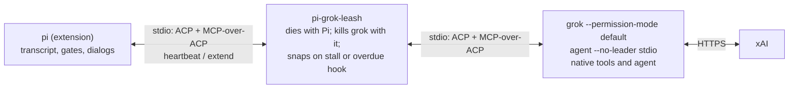

# Architecture diagram

One leash and one Grok agent per Pi process. Full walkthrough: [usage.md](usage.md#components).



```text
pi (extension)
    │ stdio: ACP + lent tools as MCP-over-ACP; heartbeat / extend
pi-grok-leash
    │ dies with Pi; kills grok with it; snaps on stall or overdue hook
    │ stdio: ACP + lent tools as MCP-over-ACP
    grok --permission-mode default agent --no-leader stdio
        │ HTTPS
        xAI
```

- Pi starts the non-detached leash on the first turn, never a shared leader or daemon. The leash spawns Grok in its own process group, with default permissions and the auto-updater disabled (`src/model/connection.ts`, `leash/src/runtime.rs`).
- Lent tools use MCP-over-ACP on the same pipe (`x.ai/mcp/sdk`, `x.ai/mcp/servers`, `_x.ai/mcp/sdk_call`); there is no MCP listener (`src/model/connection.ts`, `test/transport.test.ts`).
- “Snaps” means a group kill for a heartbeat stall, but **deny/cancel only** for an overdue hook, permission, or question. A deadline produces a one-line notice; the child and turn continue (`d4e5891`, `src/model/connection.ts`, `test/leash.test.ts`).
- Linux parent-death signals kill the leash and its immediate Grok child on abrupt Pi death, not Grok's whole group. EOF and detected stalls explicitly kill the group. Processes that left the group can survive. Other Unix targets rely on EOF/parent checks and are unverified (`leash/src/runtime.rs`, `leash/README.md`).
- `src/model/guard.ts` was removed. The leash owns the three tracked reverse methods: `_x.ai/hooks/run`, `session/request_permission`, `_x.ai/ask_user_question`, including synthetic replies and late-reply drops (`leash/src/tracker.rs`, `leash/src/runtime.rs`). Pi-to-Grok request deadlines remain in `connection.ts` `guardedRequest`, separate from those reverse requests (`test/hardening.test.ts`).
- Fake-child verification: `test/leash.test.ts`, `test/leash-process.test.ts`, `leash/tests/process.rs`. Live probes against Grok with the leash have **not been run**; the [older direct-agent results](first-class-model.md#direct-agent-and-mcp-over-acp) do not verify it.
