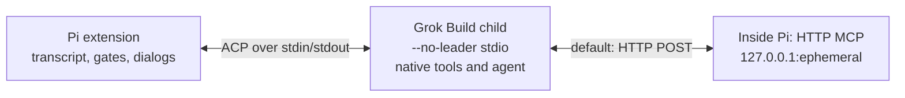

# Architecture diagram

The stdio-direct prototype. Full walkthrough: [usage.md](usage.md#components).



```text
Pi extension <-- ACP pipes --> Grok agent child (--no-leader stdio)
  HTTP MCP   <-- HTTP POST --- Grok's MCP client
```

- Pi starts one non-detached child on the first turn, never a shared leader or daemon (`src/model/connection.ts`). The child uses `--permission-mode default` and disables its auto-updater.
- Lent tools use in-process HTTP MCP by default, routed by server ID (`src/model/mcp-server.ts`). Temporary `PI_GROK_MCP=sdk` uses the ACP SDK channel instead; one path will be deleted after the Manager's live comparison.
- The guard sends one fail-closed answer per pending reverse request on orderly close and suppresses late answers (`src/model/guard.ts`). There are no ack timers. A hung-but-alive Pi is unguarded; Grok fails open on hook timeout.
- Fake-child verification: `test/transport.test.ts`. Live evidence status and session persistence limits: [design](first-class-model.md#direct-agent-lifetime-and-http-mcp).
