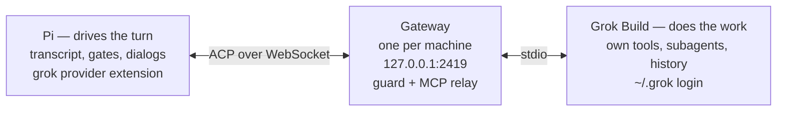

# Architecture diagram

How Pi uses Grok Build as a model provider, in one picture. For the full component walkthrough, see [usage.md](usage.md#components).

## Mermaid

Renders on GitHub and any mermaid-aware viewer.



## ASCII

Same picture, plain text. Reads anywhere monospace, no renderer needed.

```text
┌─────────────────────┐         ┌──────────────────┐         ┌─────────────────────┐
│ PI — drives turn    │         │ GATEWAY          │         │ GROK BUILD — works  │
│ transcript, gates,  │  ACP    │ one per machine  │  stdio  │ own tools, agents,  │
│ dialogs             │ over WS │ 127.0.0.1:2419   │         │ own history         │
│ grok provider ext   │◄───────►│ guard + MCP      │◄───────►│ ~/.grok login       │
└─────────────────────┘         └──────────────────┘         └─────────────────────┘
```

## What each piece does

- **Pi** owns the turn: it renders the stream, gates every Grok tool call, turns Grok's permission prompts into dialogs, and can lend its extension tools over MCP (`src/model/`, `src/model.ts`).
- **Gateway** is plumbing: one process per machine that holds the WebSocket, enforces ack deadlines on reverse requests, and relays MCP calls (`scripts/server.ts`).
- **Grok Build** owns the work: its native tools run inside its own harness, on its own session history, under its own login in `~/.grok`.

The two arrows are the whole protocol: prompts and config flow left to right, updates and callbacks flow back.
